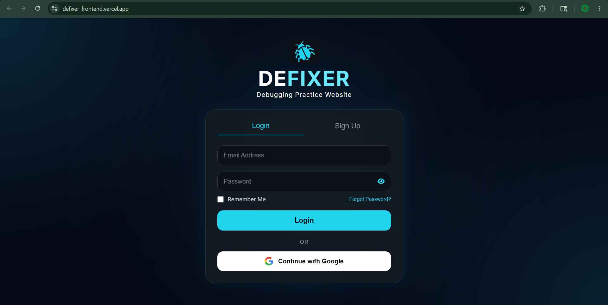
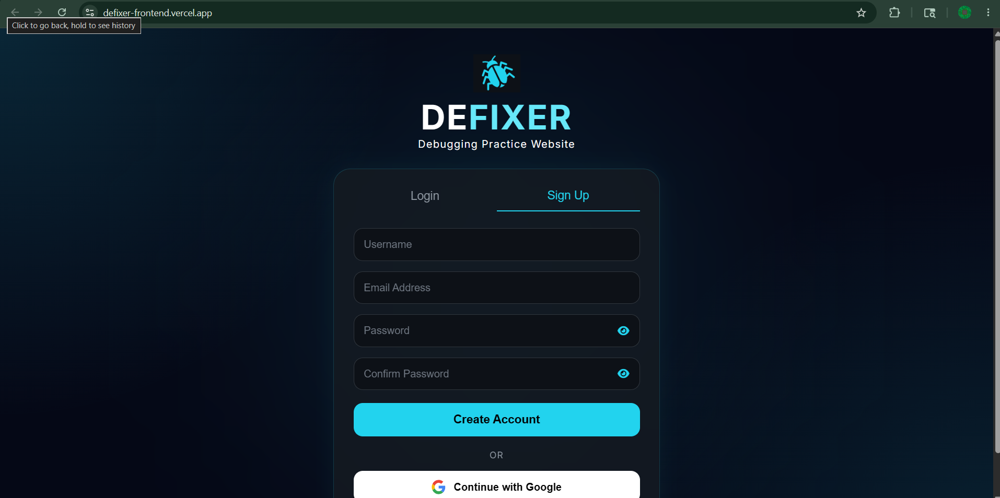

# Defixer

A futuristic debugging practice platform built for students and programmers to improve debugging and problem-solving skills through interactive coding challenges.

## Live Demo
https://defixer-frontend.vercel.app

## Features
- Login and Signup UI
- Futuristic dark theme
- Responsive design
- Smooth animations
- Debugging challenge system
- Difficulty-based practice
- Score and result system

## Tech Stack
- HTML
- CSS
- JavaScript
- Git & GitHub
- Vercel

## Screenshots

### Login Page

### Signup Page

## Future Plans
- Firebase Authentication
- Real-time leaderboard
- Multiplayer debugging battles
- Profile system
- Progress tracking
- Code editor integration
- AI-generated debugging questions

## Author
Preetis Debnath
